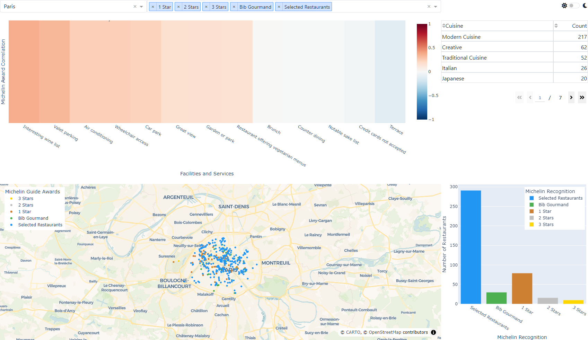
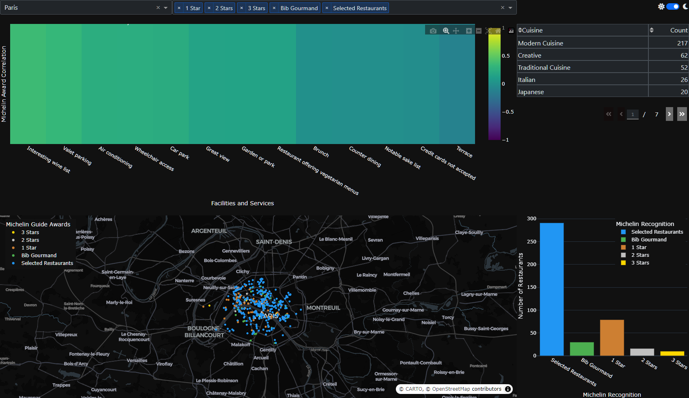

# Michelin Star Restaurant Guide Dashboard

[](https://github.com/sduzair/michelin-star-restaurant-guide-dashboard/actions/workflows/deploy.yml)

<div align="right"></div>

- [Michelin Star Restaurant Guide Dashboard](#michelin-star-restaurant-guide-dashboard)
  - [Dashboard](#dashboard)
    - [Features](#features)
      - [City Selection](#city-selection)
      - [Award Filter](#award-filter)
      - [Theme Toggle](#theme-toggle)
      - [Interactive Visualizations](#interactive-visualizations)
        - [Facility-Award Correlation Heatmap](#facility-award-correlation-heatmap)
        - [Top 5 Cuisines Table](#top-5-cuisines-table)
        - [Award Distribution Map](#award-distribution-map)
        - [Awards by City Bar Chart](#awards-by-city-bar-chart)
    - [Technical Implementation](#technical-implementation)
    - [Data Source](#data-source)
    - [Light and Dark Mode](#light-and-dark-mode)
      - [Light Mode](#light-mode)
      - [Dark Mode](#dark-mode)
    - [Conclusion](#conclusion)
  - [Plotly Autumn App Challenge 2024](#plotly-autumn-app-challenge-2024)
    - [Dataset](#dataset)
  - [Project Overview](#project-overview)
  - [Features](#features-1)
  - [Technologies Used](#technologies-used)
  - [Installation](#installation)
  - [Usage](#usage)
  - [Data Source](#data-source-1)
  - [Project Structure](#project-structure)
  - [Contributing](#contributing)
  - [License](#license)
  - [Acknowledgments](#acknowledgments)
  - [Contact](#contact)

## Dashboard

This comprehensive web application provides an interactive visualization of Michelin-starred restaurants data. The dashboard offers insights into restaurant distributions, awards, cuisines, and facilities across various cities.

**Live Application**: [Michelin Star Restaurant Guide Dashboard](https://michelin-star-restaurant-guide-dashboard.onrender.com/)

**GitHub Repository**: [michelin-star-restaurant-guide-dashboard](https://github.com/sduzair/michelin-star-restaurant-guide-dashboard)

### Features

#### City Selection

Users can select a specific city from a dropdown menu, which filters the data displayed in all visualizations.

#### Award Filter

A multi-select dropdown allows users to filter restaurants by Michelin recognition levels:

- 3 Stars
- 2 Stars
- 1 Star
- Bib Gourmand
- Selected Restaurants

#### Theme Toggle

The dashboard includes a light/dark mode toggle for user preference and improved readability in different lighting conditions.

#### Interactive Visualizations

##### Facility-Award Correlation Heatmap

This heatmap displays the correlation between restaurant facilities/services and Michelin awards for the selected city. It helps identify which amenities are most associated with higher Michelin ratings. The correlation is calculated using Point-biserial correlation, which measures the relationship between a binary variable (presence or absence of a facility) and a continuous variable (encoded Michelin award level). This method allows for quantifying the strength and direction of the association between each facility and the Michelin rating.

##### Top 5 Cuisines Table

A data table showcasing the five most prevalent cuisines in the selected city, along with their respective counts.

##### Award Distribution Map

An interactive scatter map plots the locations of Michelin-recognized restaurants in the chosen city. Each point is color-coded based on the award level, providing a geographical overview of restaurant distribution.

##### Awards by City Bar Chart

This bar chart illustrates the distribution of Michelin awards within the selected city, offering a quick comparison of the number of restaurants at each recognition level.

### Technical Implementation

The dashboard is built using the following technologies:

- Dash: A Python framework for building analytical web applications
- Plotly: For creating interactive visualizations
- Pandas: For data manipulation and analysis
- NumPy: For numerical computations
- Bootstrap: For responsive layout and styling
- SciPy: For calculating Point-biserial correlation between facilities and awards
- Scikit-learn: For one-hot encoding of facilities data using MultiLabelBinarizer

Key files in the project structure:

- `app.py`: Main application file containing the Dash layout and callbacks
- `src/data_cleaning.py`: Functions for data preprocessing
- `src/facility_award_correlation.py`: Correlation analysis between facilities and awards
- `src/figures.py`: Functions to generate various visualizations

### Data Source

The dashboard utilizes the "michelin_by_Jerry_Ng.csv" dataset, which contains detailed information about Michelin-recognized restaurants worldwide.

### Light and Dark Mode

The application supports both light and dark modes for enhanced user experience.

#### Light Mode



#### Dark Mode



### Conclusion

This Michelin Star Data Set Dashboard provides a user-friendly interface for exploring and analyzing Michelin-recognized restaurants across different cities. Its interactive features and visualizations offer valuable insights into the distribution of awards, popular cuisines, and the relationship between restaurant amenities and Michelin ratings.

## Plotly Autumn App Challenge 2024

This project is an entry for the Plotly Autumn App Challenge 2024, focusing on creating a Dash app to visualize and analyze data from the Michelin Star Restaurant Guide.

<div align="center">  </div>

### Dataset

[michelin_by_Jerry_Ng.csv](https://github.com/plotly/datasets/blob/master/michelin_by_Jerry_Ng.csv)

## Project Overview

The goal of this project is to build an interactive dashboard using Plotly's Dash framework and the new MapLibre integration. The app aims to provide insights into Michelin-starred restaurants worldwide, leveraging the dataset provided by Jerry Ng on Kaggle.

## Features

- Interactive map visualization of Michelin-starred restaurants
- Data analysis and insights on restaurant distribution
- User-friendly interface for exploring restaurant information
- Creative use of Plotly's mapping capabilities
- (Optional) Integration of Large Language Models (LLMs) for enhanced data insights

## Technologies Used

- Python
- Plotly Dash
- MapLibre
- Pandas

## Installation

- Clone this repository:

```bash
git clone <repo-uri>
```

- Install the required packages:

```bash
pip install -r requirements.txt
```

- Run the Dash app:

```bash
python app.py
```

## Usage

After running the app, open a web browser and navigate to `http://localhost:8050` to view the dashboard.

## Data Source

The data used in this project is sourced from the Michelin Star Restaurant Guide dataset provided by Jerry Ng on Kaggle.

## Project Structure

- `app.py`: Main application file
- `data/`: Directory containing the dataset
- `assets/`: CSS and other static assets
- `components/`: Reusable Dash components
- `utils/`: Utility functions and helpers

## Contributing

This project is an entry for the Plotly Autumn App Challenge and is not open for contributions. However, feel free to fork the repository and create your own version!

## License

This project is licensed under the MIT License - see the [LICENSE](./LICENSE.txt) file for details.

## Acknowledgments

- Plotly for organizing the Autumn App Challenge
- Jerry Ng for providing the Michelin Star Restaurant Guide dataset
- The Dash and MapLibre communities for their excellent documentation and support

## Contact

For any questions or feedback, please open an issue in this repository.
